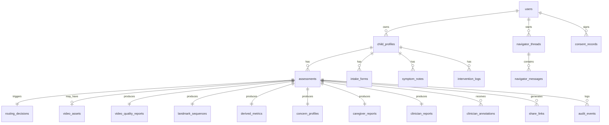

# Pedi-Growth — Data Model

**Version:** 0.1.0-draft | **Date:** 2026-04-06

---

## Entity Relationship Diagram

---

## Entity Definitions

### `users`
| Field | Type | Constraints | PII |
|-------|------|-------------|-----|
| id | uuid | PK, default gen | No |
| email | text | unique, encrypted | Yes |
| display_name | text | nullable | Yes |
| role | enum | caregiver/clinician/admin | No |
| organization | text | nullable | No |
| created_at | timestamptz | default now() | No |
| updated_at | timestamptz | auto | No |

**RLS:** Users see only own record. Admins see all (anonymized for aggregates).

---

### `child_profiles`
| Field | Type | Constraints | PII |
|-------|------|-------------|-----|
| id | uuid | PK | No |
| user_id | uuid | FK→users | No |
| name_or_alias | text | encrypted | Yes |
| date_of_birth | date | nullable, encrypted | Yes |
| age_months | integer | computed or manual | No |
| ambulatory_status | enum | independent/assisted/non_ambulant/unknown | No |
| diagnosis_status | enum | suspected/diagnosed/unknown/none | No |
| orthotics_use | boolean | default false | No |
| orthotics_type | text | nullable | No |
| mobility_aid_use | boolean | default false | No |
| mobility_aid_type | text | nullable | No |
| created_at | timestamptz | default now() | No |
| updated_at | timestamptz | auto | No |
| is_active | boolean | default true | No |

**Retention:** Persistent until user deletion request.

---

### `intake_forms`
| Field | Type | Constraints | PII |
|-------|------|-------------|-----|
| id | uuid | PK | No |
| child_profile_id | uuid | FK→child_profiles | No |
| assessment_id | uuid | FK→assessments, nullable | No |
| recent_therapy_changes | text | nullable, max 500 | No |
| recent_surgery_changes | text | nullable, max 500 | No |
| falls_frequency | enum | never/rare/weekly/daily | No |
| caregiver_concern_text | text | max 500 | No |
| consent_acknowledged | boolean | required true | No |
| consent_timestamp | timestamptz | required | No |
| clinician_organization | text | nullable | No |
| created_at | timestamptz | default now() | No |

---

### `assessments`
| Field | Type | Constraints | PII |
|-------|------|-------------|-----|
| id | uuid | PK | No |
| child_profile_id | uuid | FK→child_profiles | No |
| intake_form_id | uuid | FK→intake_forms | No |
| routing_decision_id | uuid | FK→routing_decisions | No |
| status | enum | pending/processing/complete/failed | No |
| route | enum | route_a/route_b | No |
| session_date | timestamptz | default now() | No |
| created_at | timestamptz | default now() | No |
| completed_at | timestamptz | nullable | No |

---

### `routing_decisions`
| Field | Type | Constraints | PII |
|-------|------|-------------|-----|
| id | uuid | PK | No |
| child_profile_id | uuid | FK→child_profiles | No |
| route | enum | route_a/route_b | No |
| reason | text | human-readable | No |
| input_age_months | integer | | No |
| input_ambulatory_status | enum | | No |
| input_caregiver_indication | boolean | | No |
| policy_version | text | semver | No |
| created_at | timestamptz | | No |

**Audit relevance:** HIGH — all routing decisions logged.

---

### `video_assets`
| Field | Type | Constraints | PII |
|-------|------|-------------|-----|
| id | uuid | PK | No |
| assessment_id | uuid | FK→assessments | No |
| storage_path | text | Supabase Storage ref | No |
| retention_consent | boolean | required for storage | No |
| retention_reason | text | nullable | No |
| retention_expires_at | timestamptz | nullable | No |
| mime_type | text | video/mp4 etc | No |
| duration_seconds | float | | No |
| resolution | text | e.g. 1920x1080 | No |
| file_size_bytes | integer | | No |
| created_at | timestamptz | | No |
| deleted_at | timestamptz | nullable (soft delete) | No |

**Default:** NOT created unless user explicitly opts in. Ephemeral processing.

---

### `video_quality_reports`
| Field | Type | Constraints | PII |
|-------|------|-------------|-----|
| id | uuid | PK | No |
| assessment_id | uuid | FK→assessments | No |
| overall_result | enum | pass/borderline/fail | No |
| body_visibility | float | 0-1 | No |
| single_person_confidence | float | 0-1 | No |
| camera_angle | enum | side/frontal/oblique/unknown | No |
| camera_motion | float | 0-1 | No |
| occlusion_severity | float | 0-1 | No |
| resolution_sufficient | boolean | | No |
| frame_usability_pct | float | 0-1 | No |
| detected_gait_cycles | integer | | No |
| failure_reasons | jsonb | string array | No |
| retake_instructions | text | nullable | No |
| confidence_notes | text | nullable | No |
| created_at | timestamptz | | No |

---

### `landmark_sequences`
| Field | Type | Constraints | PII |
|-------|------|-------------|-----|
| id | uuid | PK | No |
| assessment_id | uuid | FK→assessments | No |
| provider | text | mediapipe/movenet | No |
| provider_version | text | | No |
| frame_count | integer | | No |
| fps | float | | No |
| frames | jsonb | LandmarkFrame[] | No |
| created_at | timestamptz | | No |

**Note:** `frames` is an array of `{ timestamp_ms, landmarks: [{x,y,z,visibility,name}] }`. Stored as compressed JSONB.

---

### `derived_metrics`
| Field | Type | Constraints | PII |
|-------|------|-------------|-----|
| id | uuid | PK | No |
| assessment_id | uuid | FK→assessments | No |
| cadence_proxy | jsonb | {value, confidence, unit} | No |
| step_timing_symmetry | jsonb | {value, confidence} | No |
| lr_asymmetry_score | jsonb | {value, confidence} | No |
| stride_regularity | jsonb | {value, confidence} | No |
| knee_flexion_concern | jsonb | {value, confidence} | No |
| ankle_plantarflexion | jsonb | {value, confidence} | No |
| crouch_proxy | jsonb | {value, confidence} | No |
| trunk_stability | jsonb | {value, confidence} | No |
| progression_delta | jsonb | nullable, vs baseline | No |
| view_type | enum | side/frontal/both | No |
| policy_version | text | semver | No |
| created_at | timestamptz | | No |

---

### `concern_profiles`
| Field | Type | Constraints | PII |
|-------|------|-------------|-----|
| id | uuid | PK | No |
| assessment_id | uuid | FK→assessments | No |
| asymmetry_level | enum | none/mild/moderate/significant | No |
| toe_walking_level | enum | none/mild/moderate/significant | No |
| crouch_level | enum | none/mild/moderate/significant | No |
| trunk_instability_level | enum | none/mild/moderate/significant | No |
| progression_status | enum | improving/stable/worsening/insufficient | No |
| quality_warning | boolean | false | No |
| followup_priority | enum | routine/earlier_review/specialist | No |
| confidence_downgraded | boolean | false | No |
| downgrade_reasons | jsonb | string array | No |
| policy_version | text | semver | No |
| created_at | timestamptz | | No |

---

### `caregiver_reports`
| Field | Type | Constraints | PII |
|-------|------|-------------|-----|
| id | uuid | PK | No |
| assessment_id | uuid | FK→assessments | No |
| observations_text | text | plain language | No |
| confidence_text | text | | No |
| limitations_text | text | | No |
| monitoring_guidance | text | | No |
| professional_eval_guidance | text | | No |
| clinician_questions | jsonb | string array | No |
| disclaimer_text | text | | No |
| report_version | integer | auto-increment | No |
| created_at | timestamptz | | No |

---

### `clinician_reports`
| Field | Type | Constraints | PII |
|-------|------|-------------|-----|
| id | uuid | PK | No |
| assessment_id | uuid | FK→assessments | No |
| profile_summary | jsonb | | No |
| intake_context | jsonb | | No |
| quality_summary | jsonb | | No |
| metrics_table | jsonb | | No |
| concern_domains | jsonb | | No |
| trend_data | jsonb | nullable | No |
| key_frames | jsonb | nullable, thumbnail refs | No |
| structured_notes | text | nullable | No |
| report_version | integer | auto-increment | No |
| pdf_storage_path | text | nullable | No |
| created_at | timestamptz | | No |

---

### `symptom_notes`
| Field | Type | Constraints | PII |
|-------|------|-------------|-----|
| id | uuid | PK | No |
| child_profile_id | uuid | FK→child_profiles | No |
| note_date | date | | No |
| note_text | text | max 1000 | No |
| category | text | nullable | No |
| created_at | timestamptz | | No |

---

### `intervention_logs`
| Field | Type | Constraints | PII |
|-------|------|-------------|-----|
| id | uuid | PK | No |
| child_profile_id | uuid | FK→child_profiles | No |
| intervention_date | date | | No |
| intervention_type | enum | therapy/surgery/injection/orthotics/other | No |
| description | text | max 500 | No |
| created_at | timestamptz | | No |

---

### `clinician_annotations`
| Field | Type | Constraints | PII |
|-------|------|-------------|-----|
| id | uuid | PK | No |
| assessment_id | uuid | FK→assessments | No |
| clinician_user_id | uuid | FK→users | No |
| annotation_text | text | max 2000 | No |
| created_at | timestamptz | | No |

---

### `share_links`
| Field | Type | Constraints | PII |
|-------|------|-------------|-----|
| id | uuid | PK | No |
| assessment_id | uuid | FK→assessments | No |
| created_by | uuid | FK→users | No |
| token | text | unique, cryptographic | No |
| expires_at | timestamptz | default +30 days | No |
| access_count | integer | default 0 | No |
| max_accesses | integer | nullable | No |
| is_active | boolean | default true | No |
| created_at | timestamptz | | No |

---

### `navigator_threads`
| Field | Type | Constraints | PII |
|-------|------|-------------|-----|
| id | uuid | PK | No |
| user_id | uuid | FK→users | No |
| assessment_id | uuid | FK→assessments, nullable | No |
| created_at | timestamptz | | No |

**Retention:** 90 days by default.

---

### `navigator_messages`
| Field | Type | Constraints | PII |
|-------|------|-------------|-----|
| id | uuid | PK | No |
| thread_id | uuid | FK→navigator_threads | No |
| role | enum | user/assistant/system | No |
| content | text | | No |
| tool_calls | jsonb | nullable | No |
| policy_filtered | boolean | default false | No |
| filter_reason | text | nullable | No |
| created_at | timestamptz | | No |

---

### `consent_records`
| Field | Type | Constraints | PII |
|-------|------|-------------|-----|
| id | uuid | PK | No |
| user_id | uuid | FK→users | No |
| consent_type | enum | intake/video_retention/sharing | No |
| granted | boolean | | No |
| ip_address | text | encrypted | Yes |
| user_agent | text | | No |
| created_at | timestamptz | | No |

---

### `audit_events`
| Field | Type | Constraints | PII |
|-------|------|-------------|-----|
| id | uuid | PK | No |
| user_id | uuid | FK→users, nullable | No |
| event_type | text | indexed | No |
| severity | enum | info/warning/critical | No |
| entity_type | text | nullable | No |
| entity_id | uuid | nullable | No |
| details | jsonb | | No |
| policy_version | text | nullable | No |
| created_at | timestamptz | | No |

**Retention:** 2 years minimum. Append-only, no user delete.

---

### `policy_violations`
| Field | Type | Constraints | PII |
|-------|------|-------------|-----|
| id | uuid | PK | No |
| audit_event_id | uuid | FK→audit_events | No |
| violation_type | text | | No |
| attempted_content | text | | No |
| blocked_by | text | policy module name | No |
| resolved | boolean | default false | No |
| created_at | timestamptz | | No |

---

### `release_versions`
| Field | Type | Constraints | PII |
|-------|------|-------------|-----|
| id | uuid | PK | No |
| version | text | semver | No |
| policy_version | text | semver | No |
| release_notes | text | | No |
| released_by | uuid | FK→users | No |
| released_at | timestamptz | | No |
