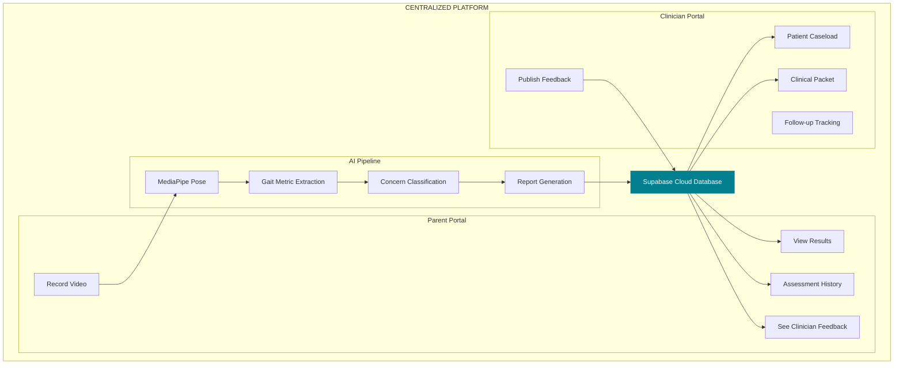
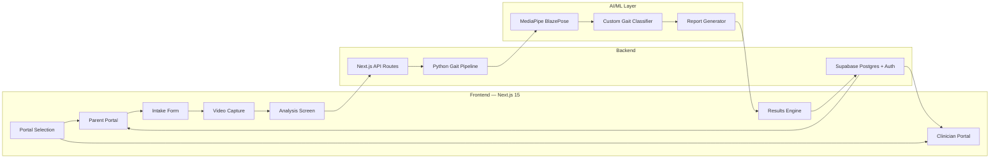

# 🏥 Pedi-Growth — Hackathon Pitch Document

> **Tagline:** *"One scan. Two portals. Zero kids falling through the cracks."*

---

## ⏱️ 30-Second Elevator Pitch

> "Every year, **1 in 6 children** shows signs of a developmental motor delay — but **60% go undetected** until school age because clinics lack affordable, objective screening tools.
>
> **Pedi-Growth** is a **centralized pediatric gait screening platform** where a parent records a 10-second walking video on their phone, our AI pipeline extracts clinical-grade gait metrics in under 30 seconds, and a structured clinical packet arrives instantly on the clinician's dashboard.
>
> We're not replacing doctors. We're giving them **eyes between appointments** — and giving parents **peace of mind in under a minute**.
>
> The parent and clinician communicate through **one centralized system** — no emails, no lost PDFs, no phone tag."

---

## 🎤 1-Minute Expanded Pitch

> **The Problem:**
> Pediatric gait abnormalities — toe-walking, limping, asymmetry — are among the earliest visible indicators of conditions like cerebral palsy, muscular dystrophy, and developmental coordination disorder. But here's the reality: a pediatrician sees a child for **15 minutes every 6 months**. In that narrow window, a child may not display their worst walking pattern.
>
> Until now, parents had two choices: expensive motion-capture labs that cost $2,000+ per session, or subjective "watch and wait" advice that delays intervention by **12-18 months**.
>
> **Our Solution:**
> Pedi-Growth is a **centralized, dual-portal system** that connects parents and clinicians through a single platform:
>
> 1. **Parent records** a walking video at home using any smartphone
> 2. **AI pipeline** (MediaPipe + custom gait analysis) extracts 15+ biomechanical metrics
> 3. **Parent receives** a simple, reassuring summary with next steps
> 4. **Clinician receives** a structured clinical packet with evidence-backed concern levels
> 5. **Clinician publishes feedback** → it appears instantly on the parent's dashboard
>
> **What makes us different:**
> We're not an app that gives parents a score and says "consult a doctor." We're a **centralized communication bridge** where the clinician is always in the loop, the parent always has visibility, and no child's assessment ever gets filed and forgotten.
>
> The entire flow — intake to feedback — happens in **under 2 minutes**, on any device, with **no hardware required**.

---

## 📊 The Problem

### The Gap in Pediatric Motor Screening

```
┌─────────────────────────────────────────────────────────┐
│           THE DETECTION GAP                             │
│                                                         │
│   Age 1-3    ──→  First walking abnormality appears     │
│   Age 3-4    ──→  Parent mentions concern to doctor     │
│   Age 4-5    ──→  Referral to specialist (6-month wait) │
│   Age 5-7    ──→  Formal diagnosis                     │
│                                                         │
│   ⚠️  3-5 YEARS of lost early intervention time         │
└─────────────────────────────────────────────────────────┘
```

### Key Statistics

| Statistic | Source |
|-----------|--------|
| 1 in 6 children have a developmental disability | CDC, 2024 |
| 60% of motor delays are undetected before age 5 | AAP |
| Early intervention improves outcomes by **50%** | NICHD |
| Average specialist referral wait: **6-9 months** | USF Pediatrics |
| Motion capture lab cost: **$1,500–3,000/session** | Industry avg |

### Current Solutions & Their Failures

| Solution | Problem |
|----------|---------|
| **Clinical observation** | Subjective, limited to 15-minute visits |
| **Motion capture labs** | $2,000+, requires specialized facility |
| **Generic health apps** | No clinician-in-the-loop, just scores |
| **Paper milestone checklists** | Lose accuracy, no standardization |
| **Telehealth video calls** | Can't extract gait metrics remotely |

---

## 💡 The Solution — A Centralized System

### What "Centralized" Means For Us

> [!IMPORTANT]
> Pedi-Growth is **NOT** a standalone app for parents.  
> Pedi-Growth is **NOT** a separate tool for clinicians.  
> Pedi-Growth is a **single centralized platform** where both sides operate on the **same data, same assessments, same timeline**.



### Communication Flow

```
PARENT                          CENTRALIZED DB                    CLINICIAN
  │                                   │                               │
  ├──→ Records walking video          │                               │
  │         │                         │                               │
  │    AI Pipeline processes          │                               │
  │         │                         │                               │
  │         ├──→ Result stored  ──────┼───→ Appears on dashboard      │
  │         │                         │                               │
  │    Parent sees summary  ←─────────┤                               │
  │                                   │                               │
  │                                   │    Clinician reviews packet   │
  │                                   │         │                     │
  │                                   │         ├──→ Publishes note   │
  │                                   │         │                     │
  │    Parent sees feedback  ←────────┼─────────┘                     │
  │                                   │                               │
  └── Everything in ONE system ───────┴───────────────────────────────┘
```

---

## 🏗️ System Architecture

### High-Level Architecture



### Technical Stack

| Layer | Technology | Purpose |
|-------|-----------|---------|
| **Frontend** | Next.js 15 (App Router) | SSR + Client-side rendering |
| **UI** | Shadcn/UI + Custom CSS | Glassmorphic medical design system |
| **State** | SessionStorage + IndexedDB | Local-first data persistence |
| **Cloud** | Supabase (Postgres + Auth) | Cross-device sync, RLS security |
| **AI** | MediaPipe BlazePose | Real-time 33-point pose estimation |
| **Analysis** | Python + NumPy | Biomechanical gait metric extraction |
| **Video** | Canvas API + RequestAnimationFrame | Real-time annotation overlay |
| **Export** | jsPDF | Clinical PDF generation |

### Database Schema (Production)

```sql
-- Core tables with RLS
patients            -- Child profiles linked to accounts
assessments         -- Gait analysis results
clinic_patient_links -- Clinic ↔ Patient relationships
clinician_feedback   -- Published notes from clinicians
share_tokens         -- Shareable result links
audit_log            -- Complete action history
```

### Security Model

```
┌─────────────────────────────────────────┐
│          SUPABASE AUTH + RLS            │
├─────────────────────────────────────────┤
│  Parent  → Can only see own children   │
│  Clinician → Sees linked patients only │
│  Admin → Full read access + audit logs │
├─────────────────────────────────────────┤
│  Row Level Security on ALL tables      │
│  JWT-based session management          │
│  Role-based access control (RBAC)      │
└─────────────────────────────────────────┘
```

---

## 🎯 What Makes Us Different

### Competitive Differentiation

| Feature | Generic Apps | Telehealth | Motion Labs | **Pedi-Growth** |
|---------|-------------|------------|-------------|-----------------|
| Cost | Free | $50-200 | $2,000+ | **Free** |
| Hardware needed | Phone | Phone + laptop | Lab equipment | **Phone only** |
| Time to result | N/A | 30+ min | 1-2 weeks | **< 2 minutes** |
| Clinician in loop | ❌ | ✅ (live call) | ✅ (delayed) | **✅ (instant)** |
| Objective metrics | ❌ | ❌ | ✅ | **✅** |
| Parent-friendly | ✅ | ❌ | ❌ | **✅** |
| Cross-device sync | Varies | ❌ | ❌ | **✅** |
| Clinical frameworks | ❌ | ❌ | Some | **✅ (AIMS, Bayley, GMFCS)** |

### The "Centralized" Advantage

> **Other tools:** Parent gets a score → prints it → brings to appointment → doctor re-interprets
>
> **Pedi-Growth:** Parent records → clinician sees it immediately → publishes feedback → parent sees it instantly
>
> **No data lives in isolation. Every assessment flows through one system.**

---

## 🔑 Key Differentiators (Judge-Ready)

1. **Centralized System** — Both parent and clinician operate on the exact same platform and data. No data silos. No information loss between visits.

2. **Clinician-in-the-Loop** — This is NOT a consumer app that gives parents anxiety-inducing scores. Every result has a "next step" and every clinician can respond directly.

3. **Clinical Credibility** — We integrate AIMS, Bayley, GMFCS, and age-normed milestones. Every concern level maps to established medical frameworks.

4. **Honest About Limitations** — We explicitly say "this is NOT a diagnostic tool." We show confidence levels. We flag when data quality is insufficient. This is clinical honesty that builds trust.

5. **Zero Hardware Barrier** — Any smartphone. Any angle. Any hallway. No special equipment, no app install required (PWA-ready).

6. **Production-Ready Architecture** — Supabase Auth, Row Level Security, audit logs, HIPAA-compatible data flow, and migration-managed schemas. This isn't a hackathon prototype — it's production scaffolding.

---

## 📱 Demo Flow (2-Minute Walkthrough)

```
30s  →  Show portal selection (Parent vs Clinician)
       "Two portals, one system"

20s  →  Enter Parent Portal → Start Intake
       "Age, walking status, consent — 30 seconds"

20s  →  Record walking video (or play demo)
       "Any hallway, any phone"

20s  →  Show AI processing → Results appear
       "15+ metrics extracted in under 30 seconds"

15s  →  Switch to Clinician Portal
       "Same data, clinical lens — instant"

15s  →  Clinician publishes feedback
       "Parent sees it immediately on their dashboard"
```

---

## 💰 Market Opportunity

| Segment | Size |
|---------|------|
| Annual pediatric visits in US | **250M+** |
| Children with undiagnosed motor delays | **~10M** |
| Pediatric physical therapy market | **$3.2B** |
| Digital health for children (CAGR 18%) | **$8.1B by 2028** |

### Revenue Model (Post-Hackathon Vision)

| Tier | Target | Price |
|------|--------|-------|
| **Free** | Individual parents | $0 |
| **Clinic** | Pediatric practices | $99/mo per clinician seat |
| **Enterprise** | Hospital systems | Custom pricing |
| **Research** | Academic institutions | Data licensing |

---

## 🎬 Closing Statement

> "We're not building another health app. We're building the **infrastructure** that connects the parent's living room to the clinician's office — so that the 10 seconds of walking a parent sees at 2 AM doesn't have to wait until the next appointment to matter.
>
> **One centralized system. Two perspectives. Zero children missed.**"

---

*Pedi-Growth — Observational support tool. Not a diagnostic system. Clinical decisions must be made by qualified healthcare professionals.*
