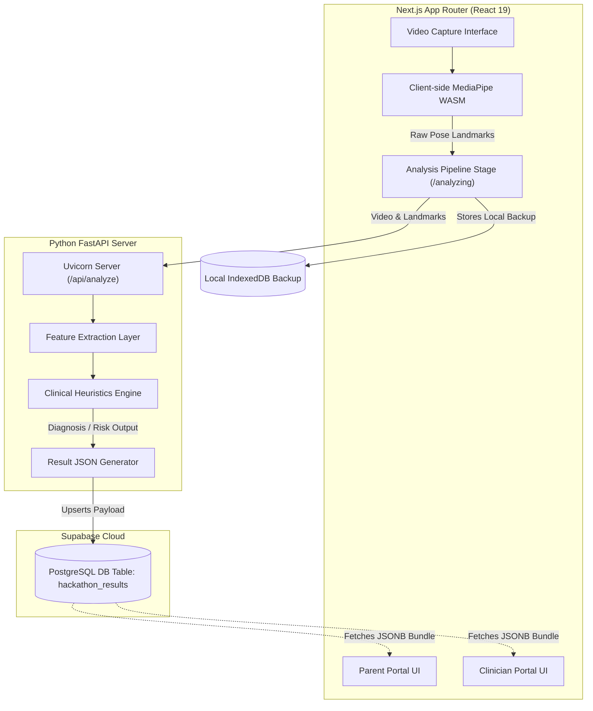

# Pedi-Growth: System Design & Technical Breakdown

## Introduction
Pedi-Growth (formerly known internally as GAITBRIDGE) is a cutting-edge clinical motor assessment platform designed to automate and augment pediatric developmental screenings. Focused heavily on gait analysis, the system evaluates movement markers to screen for early neuromuscular anomalies (such as Cerebral Palsy or Duchenne Muscular Dystrophy) and developmental delays. The platform acts as a bridge between caregiver observations captured at home and high-fidelity data interpretation used by clinicians.

---

## Technical Jargon Directory
Before diving into the system design, it is imperative to understand the clinical and technical terminology powering Pedi-Growth.

### Clinical Jargon
*   **GMFCS (Gross Motor Function Classification System):** A 5-level clinical classification system that describes the gross motor function of children with cerebral palsy.
*   **Prechtl's GMA (General Movements Assessment):** A diagnostic tool for evaluating the spontaneous movements of infants, indicating the structural integrity of the young nervous system.
*   **AIMS (Alberta Infant Motor Scale):** An observational assessment scale used to measure gross motor maturation in infants from birth through independent walking.
*   **Bayley Scales of Infant and Toddler Development:** A standard series of measurements used to assess the development of infants and toddlers, primarily for cognitive, language, and motor skills.
*   **DMD (Duchenne Muscular Dystrophy):** A severe type of muscular dystrophy that typically affects boys. Our diagnostics specifically check for heuristic flags related to DMD progression (like delayed walking or wide base of support).
*   **Heuristics Flags:** Medical indicators mapped inside the algorithm (e.g., Trunk Sway, Shoulder Tilt, Pelvic Asymmetry).

### Technical Jargon
*   **WASM (WebAssembly):** Used heavily on the client side via `@mediapipe/tasks-vision` for edge-compute computer-vision processing directly in the browser.
*   **JSONB Bridge Document Store:** A database architectural strategy used on Supabase where complex, deeply nested JSON payloads are stored inside a single relational column (`JSONB`). This enables rapid schema iteration avoiding constant relational migrations.
*   **Dual-Portal Architecture:** Pedi-Growth serves two completely different presentation layers from the exact same data payload: The **Parent Portal** (simplistic, action-focused) and the **Clinician Portal** (data-dense, Recharts time-series graphs, raw metric outputs).

---

## System Architecture

Pedi-Growth operates on a hybrid Client-Edge-Cloud architecture. 

---

### Engineering Design Breakdown
1.  **Frontend (Next.js 16 / React 19):** Handles all visual interactions, routing, and access control. Built explicitly to be mobile-responsive for caregivers capturing video. Uses Tailwind v4 and modern glassmorphism UI components.
2.  **Client-Side AI (MediaPipe):** For immediate privacy preservation and validation, first-pass visual tracking is done fully locally in the browser utilizing `@mediapipe/tasks-vision`.
3.  **Backend (Python/FastAPI):** A high-throughput Python server responsible for evaluating clinical heuristics. Calculates advanced signal metrics like "Stride Regularity," "Cadence," and "Frontal Asymmetry." Runs automated robustness benchmark gating inside CI/CD loops.
4.  **Database (Supabase PostgreSQL):** The system relies on Supabase via the `@supabase/ssr` library. During this iteration, persistence operates entirely through `cloudStorage.ts` executing read/write commands over a bridge table utilizing `JSONB` data columns.

---

## Data Process & Data Architecture Flow

The data architecture flow ensures no video files or heavy raw arrays need to repeatedly travel through the network except for the initial analysis phase.

1.  **Intake Phase:** Caregiver inputs patient metadata and captures walking video (`/capture`).
2.  **AI Pipeline Execution (`/analyzing`):** 
    *   The browser executes client-side validation checks (lighting, bounding boxes).
    *   The Python backend receives motion data, derives spatial kinematics, and cross-references with GMFCS & age-norm tables.
    *   A massive `JSON` bundle containing normalized metrics, follow-up severity flags, and localized text is built.
3.  **Data Persistence (`cloudStorage.ts`):** 
    *   The App attempts an `upsert` against the `hackathon_results` table within the Supabase cloud instance.
    *   *Resiliency Fallback Sequence:* Cloud (Primary) ➔ IndexedDB (Local Cache) ➔ `sessionStorage` (Legacy Session state).
4.  **Portal Retrieval (`/results/[id]`):** 
    *   Different routes fetch the exact same Supabase JSONB bundle based on the specific UUID resulting `id`.
    *   The **Parent UI** (`/results/[id]`) masks complicated terms into actionable items (e.g., translates "Mild Trunk Sway" into "Movement looks fine, keep observing").
    *   The **Clinician UI** (`/results/[id]/clinician`) visualizes complex heuristics through robust `<NeuromuscularGraphArea />` components plotting XYZ vector movement over a time series.
